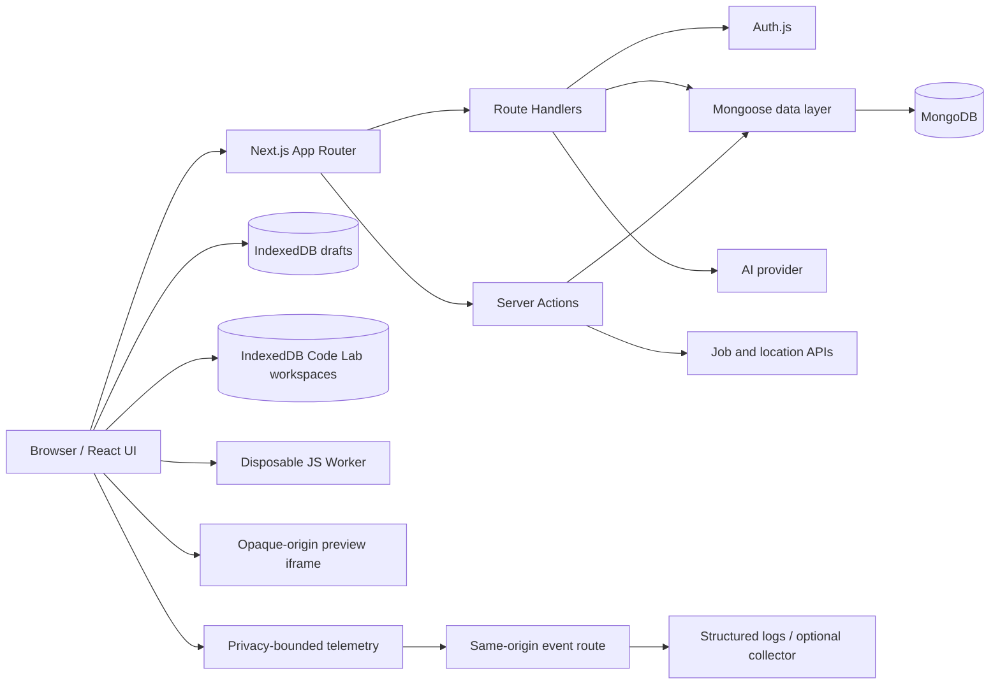

# DevFlow

DevFlow 是一个面向开发者的问答社区。用户可以发布编程问题、回答、投票、收藏和搜索内容，也可以通过 AI 辅助完善回答。项目使用 Next.js App Router 同时承载页面、Server Actions 和 Route Handlers，使用 MongoDB 持久化问答与用户行为。

## 当前功能

- 凭据、GitHub 和 Google 登录（OAuth 需要单独配置）
- 问题发布、编辑、删除、标签和安全 Markdown 预览
- 回答、采纳/取消采纳、赞/踩、收藏、浏览量与声望统计
- 新回答与答案被采纳的持久化通知、未读数、深链和全部已读
- 投票与收藏的乐观更新、失败回滚和服务端最终状态对齐
- 基于 IndexedDB 的问题/回答自动草稿、刷新恢复与账号隔离
- `⌘/Ctrl + K` 全局搜索面板：全文问题检索、分类筛选、键盘导航、可取消请求与回答深链
- 可解释推荐信息流：真实浏览/投票/收藏/回答信号、30 天半衰期、冷启动趋势补齐、推荐理由与“不感兴趣 + Undo”
- 首页使用 HMAC 签名的 cursor 与无限滚动，固定 `asOf`、量化分数并以 `createdAt/_id` 完成稳定排序；社区和个人主页保留适合各自场景的分页
- 可观测性基线：Core Web Vitals、全局客户端异常、React 错误边界与 Next.js 服务端请求错误；默认关闭且可采样，无第三方账号时直接输出结构化日志
- AI 提问分析台：流式质量评分、缺失信息、标签建议、可解释相似问题，以及可逐条应用和安全撤销的局部 Diff
- AI 分析具有小时/每日双层额度；同一次额度内最多尝试 2 次（失败后至多自动重试 1 次）
- Code Lab 浏览器代码沙箱：支持 JavaScript 与 HTML/CSS/JS，包含运行/停止/重置、日志、异常、超时和本地 Fork
- JavaScript 使用一次性 Blob module Worker 隔离执行，支持顶层 `await` 与 `sandboxResult(value)` 结果回传；HTML 预览使用无同源权限的 sandbox iframe
- 需登录且有额度限制的 AI 回答辅助
- 职位搜索与国家/地区筛选（第三方 API 可选）
- 数据库健康检查和可重复执行的演示数据脚本

## 技术栈

| 领域       | 技术                                                          |
| ---------- | ------------------------------------------------------------- |
| 前端       | Next.js 16、React 19、TypeScript、Tailwind CSS 4、Radix UI    |
| 表单与验证 | React Hook Form、Zod                                          |
| 认证       | Auth.js / NextAuth 5                                          |
| 数据       | MongoDB、Mongoose                                             |
| 推荐与检索 | 确定性行为权重、指数时间衰减、MongoDB Text Index、签名 Cursor |
| 浏览器存储 | IndexedDB（未发布草稿与 Code Lab 工作区）                     |
| 代码沙箱   | Web Worker、sandbox iframe、MessageChannel、父线程超时控制    |
| 内容       | MDX Editor、next-mdx-remote（仅按安全 Markdown 渲染）         |
| AI         | Vercel AI SDK、OpenAI-compatible provider                     |
| 工程化     | ESLint、TypeScript、Vitest、Playwright、Lighthouse CI、GitHub Actions |
| 可观测性   | Core Web Vitals、Next.js instrumentation、Pino 结构化日志       |
| 部署       | Next.js standalone、Docker、多阶段非 root 运行镜像              |

## 架构



主要代码边界：

- `app/`：页面、布局和 HTTP Route Handlers。
- `components/`：可复用 UI、表单、编辑器和业务交互。
- `lib/actions/`：输入验证、授权、业务逻辑和缓存失效。
- `database/`：Mongoose Schema 和 Model。
- `scripts/`：本地健康检查与幂等演示数据初始化。

更深入的项目资料：

- [系统架构与关键设计](./docs/ARCHITECTURE.md)
- [测试分层与验收清单](./docs/TESTING.md)
- [生产部署、监控与回滚](./docs/DEPLOYMENT.md)
- [面试演示与录屏脚本](./docs/DEMO.md)

### 推荐信息流的边界

推荐不是机器学习模型，而是一套可复现、可解释的规则排序：

1. 登录用户的点赞/点踩、收藏和回答直接读取对应事实表；浏览只为同一“用户—问题”保留一条最近信号，避免刷新页面无限增加兴趣权重。
2. 行为贡献按 `2^(-ageDays / 30)` 衰减；收藏、点赞、回答、发布、浏览使用不同权重，点踩作为负向标签信号。
3. 候选问题在服务端有 240 条硬上限，正文不会进入 Feed DTO。兴趣匹配、新鲜度和对数热度在纯函数中量化成整数分数，再按 `score → createdAt → _id` 形成全序。
4. 匿名用户和没有历史的新用户不建立指纹，直接使用同一套带新鲜度衰减的社区趋势分；个性化候选不足时趋势内容自然补齐。
5. Cursor 固定首次请求的 `asOf`，并使用 `AUTH_SECRET` 做 HMAC-SHA256 签名，同时绑定用户、筛选和搜索指纹。接口返回 `private, no-store`，客户端仍按问题 ID 去重并使用 `AbortController` 处理竞态。
6. “不感兴趣”是独立、幂等、可撤销的当前偏好，不混进行为历史；删除问题时会在同一事务中清理对应反馈。

固定 `asOf` 能稳定时间衰减与候选创建时间，但不能冻结翻页期间发生的实时投票/浏览计数变化；因此这里实现的是有稳定兜底和客户端去重的 keyset cursor，不声称数据库快照级强一致分页。

### Code Lab 的隔离模型

`/playground` 是一个不依赖登录、后端数据库或 AI 服务的纯浏览器工作区，方便在线演示：

- 每次 JavaScript 运行都会创建新的 Blob module Worker，可信 bootstrap、用户源码和完成回传位于独立 ES module 词法作用域；用户源码无法通过声明或括号改写可信运行时。每次运行使用独立 `runId` 和单调事件序号；父线程负责 Stop 和 timeout，所以 Worker 内即使出现同步死循环也能被外部 `terminate()`。
- Worker 和页面通过一次性 `MessageChannel` 通信；日志会先转换成有深度、长度和条数上限的纯文本，能够处理循环对象、`BigInt`、`Error`、getter 异常等特殊值。
- HTML/CSS/JS 使用只有 `sandbox="allow-scripts"` 的 `srcDoc` iframe，不授予 `allow-same-origin`、表单、弹窗、顶层导航或下载权限；子文档 CSP 继续禁止网络、子 frame、Worker 和对象资源。
- 用户文件通过 `MessageChannel` 传入，再使用 `innerHTML`、`textContent` 和动态脚本节点分别应用。源码不直接拼进 `srcDoc`，因此 `</script>` / `</style>` 不能提前结束运行时模板。
- 工作区与当前选择保存在独立 IndexedDB 中；Fork 会生成新的项目 ID 和父项目引用，后续编辑不会修改原副本。

HTML iframe 提供的是权限与来源隔离，不等于独立 CPU 线程。异步挂起可以按时销毁 iframe，但部分浏览器中同步死循环仍可能阻塞父页面渲染线程；需要硬终止 CPU 任务时应使用 JavaScript Worker 模式。该项目面向用户运行自己的代码，不声称能够安全执行任意恶意程序。

## 本地运行

### 1. 环境要求

- Node.js 22 或更高版本（当前已在 Node.js 24 验证）
- pnpm 11
- MongoDB Atlas，或者本地 MongoDB

> 注意：注册、发布问题等流程使用 MongoDB 事务。完整测试这些流程时，请使用 Atlas 或启用 replica set 的本地 MongoDB。

### 2. 安装与配置

```bash
corepack enable
pnpm install
cp .env.example .env.local
```

然后编辑 `.env.local`，至少设置：

```dotenv
MONGODB_URI=your-local-or-atlas-connection-string
AUTH_SECRET=your-long-random-secret
AUTH_URL=http://localhost:3000
NEXT_PUBLIC_APP_URL=http://localhost:3000
DEMO_USER_PASSWORD=your-own-strong-demo-password
```

`AUTH_SECRET` 可以在本地生成：

```bash
openssl rand -base64 32
```

### 3. 检查数据库并初始化演示数据

```bash
pnpm health
pnpm seed
```

`pnpm seed` 会创建 4 个演示用户、11 个标签、20 个带时间分布的问题、3 个回答、14 条真实投票、一条采纳关系、2 条通知，以及可展示个性化、冷启动、负反馈和下一页 cursor 的行为数据。问题与回答的赞踩数会根据 Vote 记录重新统计。可以使用以下账号登录：

- 邮箱：`demo@devflow.local`
- 密码：你在本地 `DEMO_USER_PASSWORD` 中设置的值

种子脚本使用稳定标记进行 upsert，重复执行不会重复创建演示记录；它不会输出 MongoDB URI 或密码，也会拒绝在 `NODE_ENV=production` 下运行。

如果数据库来自第一周之前的旧版本，请先备份并暂停应用写入，再执行第二周迁移。默认命令只读检查；确认报告后才显式应用：

```bash
pnpm migrate:week2
pnpm migrate:week2 --apply
```

迁移会清理无效、自投和重复 Vote，去重收藏，按 Vote 重算赞踩数，并创建 Vote/Collection 复合唯一索引。它不会重算历史声望，因为仅凭旧 Vote 无法可靠还原过去已经发放的声望。

第三周的相似问题检索需要 MongoDB 全文与标签索引。和第二周一样，先只读检查，再显式应用：

```bash
pnpm migrate:week3
pnpm migrate:week3 --apply
```

迁移会为历史问题补齐有界的内部检索词（包含 `C#` / `C++` 别名和中文双字词），并创建 `question_similarity_text` 和 `question_similarity_tags` 两个索引。正式库执行 `--apply` 时建议短暂停止写入；脚本也会检测并发修改，遇到冲突会在更改索引前安全停止。它只会自动升级本项目早期生成的同名纯文本索引；如果数据库已经存在其他全文索引或意外结构，脚本会停止并要求人工确认，不会自动删除未知索引。

第七周的信息流需要先清理旧版重复浏览信号，再创建用户行为、Feed 排序和负反馈索引。仍然先执行只读检查：

```bash
pnpm migrate:week7
pnpm migrate:week7 --apply
pnpm migrate:week7
```

最后一次 dry-run 应报告没有重复浏览记录且全部索引就绪。迁移只会删除同一用户对同一问题的旧版重复 `view`，保留最近一条；同名索引结构异常时会停止，不会自动替换未知索引。

### 4. 启动开发服务器

```bash
pnpm dev
```

打开 [http://localhost:3000](http://localhost:3000)。服务启动后也可以请求 `GET /api/health`：数据库可用时返回 `200`，不可用时返回 `503`，响应中不包含内部错误或连接信息。

## 环境变量

| 变量                                               | 是否必需 | 用途                                                             |
| -------------------------------------------------- | -------- | ---------------------------------------------------------------- |
| `MONGODB_URI`                                      | 是       | 服务端 MongoDB 连接字符串                                        |
| `AUTH_SECRET`                                      | 是       | Auth.js 签名密钥                                                 |
| `AUTH_URL`                                         | 生产必需 | Auth.js 信任的公开 HTTPS 来源与 OAuth 回调基址                  |
| `NEXT_PUBLIC_APP_URL`                              | 生产必需 | Canonical、Open Graph、robots 和 sitemap 使用的公开 HTTPS 域名   |
| `AUTH_GITHUB_ID` / `AUTH_GITHUB_SECRET`            | 否       | GitHub OAuth                                                     |
| `AUTH_GOOGLE_ID` / `AUTH_GOOGLE_SECRET`            | 否       | Google OAuth                                                     |
| `AI_API_KEY`                                       | 否       | AI provider 服务端密钥                                           |
| `MINIMAX_API_KEY`                                  | 否       | 旧配置兼容，新环境优先使用 `AI_API_KEY`                          |
| `AI_BASE_URL` / `AI_MODEL`                         | 否       | OpenAI-compatible 接口地址与模型                                 |
| `AI_SUPPORTS_STRUCTURED_OUTPUTS`                   | 否       | Provider 明确支持 OpenAI JSON Schema 时设为 `true`，默认 `false` |
| `AI_RATE_LIMIT_PER_HOUR` / `AI_RATE_LIMIT_PER_DAY` | 否       | 单用户 AI 小时/每日额度，默认 10/30                              |
| `AI_MAX_OUTPUT_TOKENS`                             | 否       | AI 单次最大输出的全局覆盖值；提问分析/回答辅助默认 2200/1800     |
| `AI_REQUEST_TIMEOUT_MS`                            | 否       | AI 请求总超时，默认 30000ms                                      |
| `RAPID_API_KEY`                                    | 否       | 职位搜索 API                                                     |
| `DEFAULT_JOB_LOCATION`                             | 否       | 职位页无筛选条件时使用的默认地区                                 |
| `LOG_LEVEL`                                        | 否       | 服务端日志级别，默认 `info`                                      |
| `OBSERVABILITY_ENABLED`                            | 否       | 运行时开启服务端错误及同源监控接口，默认关闭                     |
| `NEXT_PUBLIC_OBSERVABILITY_ENABLED`                | 否       | 构建时开启浏览器性能/错误采集，不是密钥，默认关闭          |
| `NEXT_PUBLIC_WEB_VITALS_SAMPLE_RATE`               | 否       | Web Vitals 页面级采样率 `0–1`，默认 `0.1`                            |
| `OBSERVABILITY_ENDPOINT` / `OBSERVABILITY_TOKEN`   | 否       | 可选的服务端 HTTPS 收集端与 Bearer Token                            |
| `DEMO_USER_PASSWORD`                               | 仅 seed  | 本地演示账号密码                                                 |

`NEXT_PUBLIC_` 前缀的值会在构建时进入浏览器包，不能用于密钥、数据库 URI 或其他秘密。浏览器访问本项目 API 时固定使用同源 `/api`。完整模板和注释见 [`.env.example`](./.env.example)。

## 工程检查

```bash
pnpm lint       # ESLint
pnpm typecheck  # TypeScript，不产生文件
pnpm check      # lint + typecheck
pnpm test:unit  # Vitest 纯逻辑与组件测试
pnpm test:e2e   # Playwright 核心用户路径
pnpm test:lighthouse # Lighthouse 性能、可访问性、SEO 与最佳实践预算
pnpm check:week3-search # 检查中英混合分词、技术别名与输入上限
pnpm check:week4-draft-edits # 检查局部 Diff 的应用、撤销与 CAS 冲突保护
pnpm check:week4-stream # 检查 AI 流式事件顺序与受控重试协议
pnpm check:week4 # 运行全部第四周 AI 纯逻辑检查
pnpm check:week56 # 检查沙箱协议、消息边界、日志序列化、Worker 与 iframe 源码构造
pnpm check:week7 # 检查行为权重、时间衰减、理由、全序与签名 cursor
pnpm build      # Next.js 生产构建（稳定的 webpack 路径）
pnpm build:turbopack # 可选：验证 Turbopack 构建
pnpm health     # 直接 ping MongoDB
pnpm migrate:week2 # 只读审计旧数据库；加 --apply 才执行迁移
pnpm migrate:week3 # 只读审计检索词与索引；加 --apply 才同步并创建
pnpm migrate:week7 # 只读审计浏览去重和 Feed 索引；加 --apply 才执行
```

生产构建会同时生成 `.next/standalone`，可直接使用仓库中的多阶段 `Dockerfile`；完整环境变量、健康检查和回滚流程见 [部署手册](./docs/DEPLOYMENT.md)。

GitHub Actions 会在 push 和 pull request 时执行依赖安装、lint、typecheck、Vitest、第四周 AI Diff/流协议检查、第五至六周沙箱协议检查、第七周推荐/cursor 检查、MongoDB 健康检查、两次演示数据初始化、第二/三/七周数据与索引迁移验证、生产构建、Playwright 端到端测试与 Lighthouse 质量预算。连续执行两次 seed 可以及时发现幂等性回归。CI 使用一个临时 MongoDB service container 和非生产占位配置，不会访问真实数据库、OAuth 或 AI 账号。

## 安全注意事项

- 只提交 `.env.example`，不要提交 `.env.local` 或生产密钥。
- 不要将任何私密变量改成 `NEXT_PUBLIC_*`。
- 演示账号只用于本地/预览环境；共享预览环境前应更换密码。
- AI 路由需要登录，小时/每日额度由 MongoDB 记录；多实例部署时不依赖单进程内存状态。
- AI 提问分析使用有上限的 NDJSON 流，受控重试不重复扣额度；局部 Diff 通过 compare-and-swap 检查防止覆盖用户的新编辑。相似问题由本地索引和确定性评分完成，AI 不可用时仍可独立工作。
- Code Lab 使用 Worker/iframe 隔离、一次性消息通道、运行身份校验和有界日志；不要为了执行用户代码给站点生产 CSP 增加 `unsafe-eval`。
- 采纳、回答计数、通知和删除清理共享 MongoDB 事务，避免出现半成功状态。
- 推荐只为登录用户保存与问题关联的最近浏览信号，不记录匿名 IP、User-Agent、设备指纹、原始搜索词或正文；“不感兴趣”可在 Toast 中立即撤销。每个“用户—问题”只保留最近一条浏览状态，画像只读取最近 90 天；当前没有自动过期或完整的行为历史导出/清空中心，因此不声称具备完整隐私合规系统。
- Vote/Collection/Notification 使用复合唯一索引防重；旧数据库上线前需先执行 `pnpm migrate:week2`，启用相似问题检索前需执行 `pnpm migrate:week3`，启用新信息流前需执行 `pnpm migrate:week7`。
- 部署平台的健康检查可使用 `/api/health`，但不要在该响应中增加 URI、堆栈或密钥。
- 可观测性默认关闭。本监控事件管道只上报脱敏路径、Web Vitals 数值、错误类型/指纹和服务端 digest；不发送查询参数、请求头、原始错误消息、堆栈、用户输入或身份信息。常规服务端诊断日志仍可能包含异常堆栈，生产日志平台需要独立的访问控制与留存策略。

## 生产运行

DevFlow 依赖认证、Server Actions、Route Handlers 和 MongoDB，因此需要 Node.js 服务器或支持完整 Next.js 能力的平台，不是纯静态导出项目。

```bash
pnpm install --frozen-lockfile
pnpm build
pnpm start
```

生产环境中应由部署平台注入环境变量，并确保 MongoDB 允许来自运行环境的连接。不要在生产环境执行演示数据脚本。
上线前的迁移、健康检查、可观测性验证和回滚步骤见 [部署手册](./docs/DEPLOYMENT.md)。
