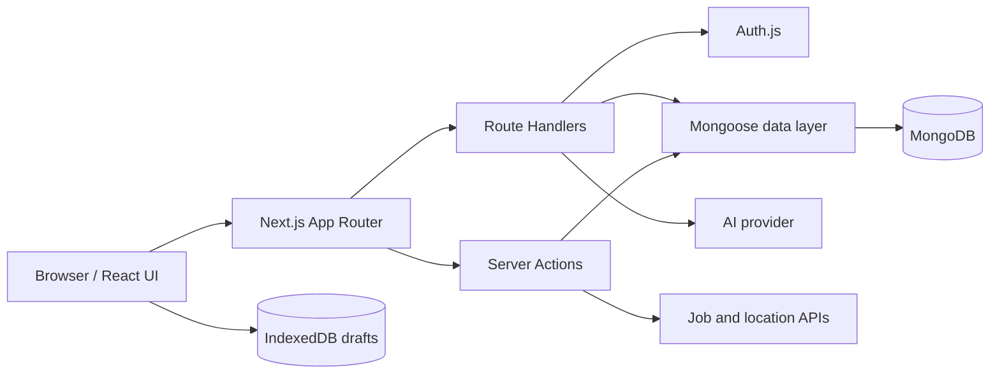

# DevFlow

DevFlow 是一个面向开发者的问答社区。用户可以发布编程问题、回答、投票、收藏和搜索内容，也可以通过 AI 辅助完善回答。项目使用 Next.js App Router 同时承载页面、Server Actions 和 Route Handlers，使用 MongoDB 持久化问答与用户行为。

## 当前功能

- 凭据、GitHub 和 Google 登录（OAuth 需要单独配置）
- 问题发布、编辑、删除、标签和安全 Markdown 预览
- 回答、采纳/取消采纳、赞/踩、收藏、浏览量与声望统计
- 新回答与答案被采纳的持久化通知、未读数、深链和全部已读
- 投票与收藏的乐观更新、失败回滚和服务端最终状态对齐
- 基于 IndexedDB 的问题/回答自动草稿、刷新恢复与账号隔离
- 全局搜索、页内筛选、分页、社区和个人主页
- 基于用户交互与标签的初步问题推荐
- AI 提问分析台：流式质量评分、缺失信息、标签建议和可解释相似问题
- 需登录且有额度限制的 AI 回答辅助
- 职位搜索与国家/地区筛选（第三方 API 可选）
- 数据库健康检查和可重复执行的演示数据脚本

## 技术栈

| 领域 | 技术 |
| --- | --- |
| 前端 | Next.js 16、React 19、TypeScript、Tailwind CSS 4、Radix UI |
| 表单与验证 | React Hook Form、Zod |
| 认证 | Auth.js / NextAuth 5 |
| 数据 | MongoDB、Mongoose |
| 浏览器存储 | IndexedDB（未发布草稿） |
| 内容 | MDX Editor、next-mdx-remote（仅按安全 Markdown 渲染） |
| AI | Vercel AI SDK、OpenAI-compatible provider |
| 工程化 | ESLint、TypeScript、pnpm、GitHub Actions |

## 架构



主要代码边界：

- `app/`：页面、布局和 HTTP Route Handlers。
- `components/`：可复用 UI、表单、编辑器和业务交互。
- `lib/actions/`：输入验证、授权、业务逻辑和缓存失效。
- `database/`：Mongoose Schema 和 Model。
- `scripts/`：本地健康检查与幂等演示数据初始化。

## 本地运行

### 1. 环境要求

- Node.js 22 或更高版本（当前已在 Node.js 24 验证）
- pnpm 11
- MongoDB Atlas，或者本地 MongoDB

> 注意：注册、发布问题等流程使用 MongoDB 事务。完整测试这些流程时，请使用 Atlas 或启用 replica set 的本地 MongoDB。

### 2. 安装与配置

```bash
corepack enable
pnpm install
cp .env.example .env.local
```

然后编辑 `.env.local`，至少设置：

```dotenv
MONGODB_URI=your-local-or-atlas-connection-string
AUTH_SECRET=your-long-random-secret
DEMO_USER_PASSWORD=your-own-strong-demo-password
```

`AUTH_SECRET` 可以在本地生成：

```bash
openssl rand -base64 32
```

### 3. 检查数据库并初始化演示数据

```bash
pnpm health
pnpm seed
```

`pnpm seed` 会创建 2 个演示用户、5 个标签、3 个问题、3 个回答、6 条真实投票、一条采纳关系、2 条通知和少量交互数据。问题与回答的赞踩数会根据 Vote 记录重新统计。可以使用以下账号登录：

- 邮箱：`demo@devflow.local`
- 密码：你在本地 `DEMO_USER_PASSWORD` 中设置的值

种子脚本使用稳定标记进行 upsert，重复执行不会重复创建演示记录；它不会输出 MongoDB URI 或密码，也会拒绝在 `NODE_ENV=production` 下运行。

如果数据库来自第一周之前的旧版本，请先备份并暂停应用写入，再执行第二周迁移。默认命令只读检查；确认报告后才显式应用：

```bash
pnpm migrate:week2
pnpm migrate:week2 --apply
```

迁移会清理无效、自投和重复 Vote，去重收藏，按 Vote 重算赞踩数，并创建 Vote/Collection 复合唯一索引。它不会重算历史声望，因为仅凭旧 Vote 无法可靠还原过去已经发放的声望。

第三周的相似问题检索需要 MongoDB 全文与标签索引。和第二周一样，先只读检查，再显式应用：

```bash
pnpm migrate:week3
pnpm migrate:week3 --apply
```

迁移会为历史问题补齐有界的内部检索词（包含 `C#` / `C++` 别名和中文双字词），并创建 `question_similarity_text` 和 `question_similarity_tags` 两个索引。正式库执行 `--apply` 时建议短暂停止写入；脚本也会检测并发修改，遇到冲突会在更改索引前安全停止。它只会自动升级本项目早期生成的同名纯文本索引；如果数据库已经存在其他全文索引或意外结构，脚本会停止并要求人工确认，不会自动删除未知索引。

### 4. 启动开发服务器

```bash
pnpm dev
```

打开 [http://localhost:3000](http://localhost:3000)。服务启动后也可以请求 `GET /api/health`：数据库可用时返回 `200`，不可用时返回 `503`，响应中不包含内部错误或连接信息。

## 环境变量

| 变量 | 是否必需 | 用途 |
| --- | --- | --- |
| `MONGODB_URI` | 是 | 服务端 MongoDB 连接字符串 |
| `AUTH_SECRET` | 是 | Auth.js 签名密钥 |
| `AUTH_GITHUB_ID` / `AUTH_GITHUB_SECRET` | 否 | GitHub OAuth |
| `AUTH_GOOGLE_ID` / `AUTH_GOOGLE_SECRET` | 否 | Google OAuth |
| `AI_API_KEY` | 否 | AI provider 服务端密钥 |
| `MINIMAX_API_KEY` | 否 | 旧配置兼容，新环境优先使用 `AI_API_KEY` |
| `AI_BASE_URL` / `AI_MODEL` | 否 | OpenAI-compatible 接口地址与模型 |
| `AI_SUPPORTS_STRUCTURED_OUTPUTS` | 否 | Provider 明确支持 OpenAI JSON Schema 时设为 `true`，默认 `false` |
| `AI_RATE_LIMIT_PER_HOUR` / `AI_RATE_LIMIT_PER_DAY` | 否 | 单用户 AI 小时/每日额度，默认 10/30 |
| `AI_MAX_OUTPUT_TOKENS` | 否 | AI 单次最大输出，默认 1800 |
| `AI_REQUEST_TIMEOUT_MS` | 否 | AI 请求总超时，默认 30000ms |
| `RAPID_API_KEY` | 否 | 职位搜索 API |
| `DEFAULT_JOB_LOCATION` | 否 | 职位页无筛选条件时使用的默认地区 |
| `LOG_LEVEL` | 否 | 服务端日志级别，默认 `info` |
| `DEMO_USER_PASSWORD` | 仅 seed | 本地演示账号密码 |

`NEXT_PUBLIC_` 前缀的值会在构建时进入浏览器包，不能用于密钥、数据库 URI 或其他秘密。浏览器访问本项目 API 时固定使用同源 `/api`。完整模板和注释见 [`.env.example`](./.env.example)。

## 工程检查

```bash
pnpm lint       # ESLint
pnpm typecheck  # TypeScript，不产生文件
pnpm check      # lint + typecheck
pnpm check:week3-search # 检查中英混合分词、技术别名与输入上限
pnpm build      # Next.js 生产构建（稳定的 webpack 路径）
pnpm build:turbopack # 可选：验证 Turbopack 构建
pnpm health     # 直接 ping MongoDB
pnpm migrate:week2 # 只读审计旧数据库；加 --apply 才执行迁移
pnpm migrate:week3 # 只读审计检索词与索引；加 --apply 才同步并创建
```

GitHub Actions 会在 push 和 pull request 时执行依赖安装、lint、typecheck、MongoDB 健康检查、两次演示数据初始化、第二周数据迁移验证、第三周索引迁移验证和生产构建。连续执行两次 seed 可以及时发现幂等性回归。CI 使用一个临时 MongoDB service container 和非生产占位配置，不会访问真实数据库、OAuth 或 AI 账号。

## 安全注意事项

- 只提交 `.env.example`，不要提交 `.env.local` 或生产密钥。
- 不要将任何私密变量改成 `NEXT_PUBLIC_*`。
- 演示账号只用于本地/预览环境；共享预览环境前应更换密码。
- AI 路由需要登录，额度由 MongoDB 记录；多实例部署时不依赖单进程内存状态。
- AI 提问分析使用有上限的 NDJSON 流；相似问题由本地索引和确定性评分完成，AI 不可用时仍可独立工作。
- 采纳、回答计数、通知和删除清理共享 MongoDB 事务，避免出现半成功状态。
- Vote/Collection/Notification 使用复合唯一索引防重；旧数据库上线前需先执行 `pnpm migrate:week2`，启用相似问题检索前需执行 `pnpm migrate:week3`。
- 部署平台的健康检查可使用 `/api/health`，但不要在该响应中增加 URI、堆栈或密钥。

## 生产运行

DevFlow 依赖认证、Server Actions、Route Handlers 和 MongoDB，因此需要 Node.js 服务器或支持完整 Next.js 能力的平台，不是纯静态导出项目。

```bash
pnpm install --frozen-lockfile
pnpm build
pnpm start
```

生产环境中应由部署平台注入环境变量，并确保 MongoDB 允许来自运行环境的连接。不要在生产环境执行演示数据脚本。
