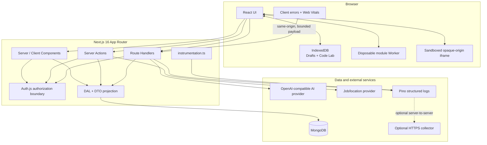
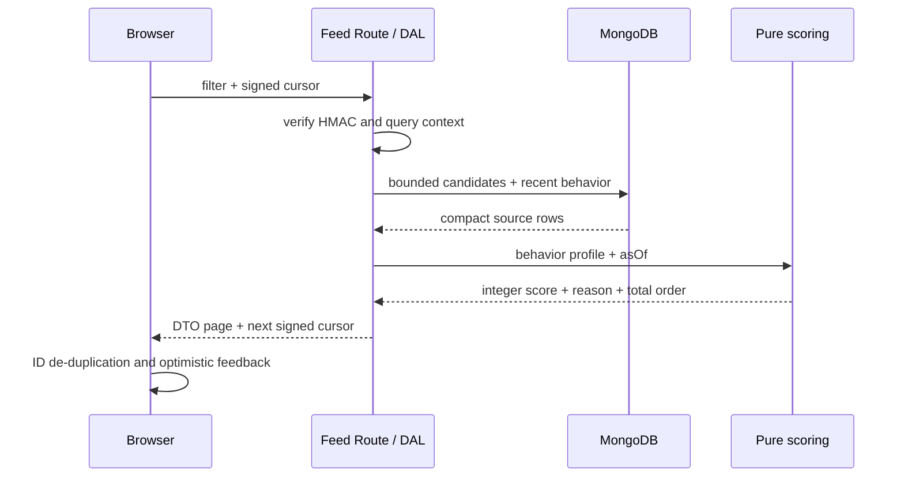
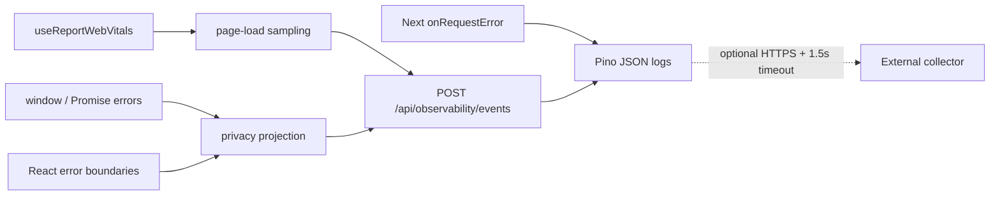

# DevFlow 系统架构

这份文档用于回答两个问题：一次用户操作穿过了哪些边界，以及项目的技术难点为什么不是“只调一个 API”。

## 1. 系统全景

## 2. 代码边界

| 目录/入口 | 职责 | 不应承担的职责 |
| --- | --- | --- |
| `app/` | 路由、布局、HTTP 边界和服务端组装 | 大量可复用的排序/计算逻辑 |
| `components/` | UI 、交互和小型客户端边界 | 直接访问 MongoDB 或服务端密钥 |
| `lib/dal/` | 数据读取、有界查询和 DTO 投影 | 渲染 UI |
| `lib/actions/` | 输入验证、授权、事务和缓存失效 | 信任客户端传入的用户 ID |
| `lib/recommendation/` | 无 I/O 的评分、时间衰减和 Cursor 签名 | 数据库连接和 React 状态 |
| `lib/observability/` | 脱敏、采样、事件建模与服务端转发 | 用户输入、Cookie 和请求头采集 |
| `database/` | Schema、索引和 Model | 页面展示逻辑 |
| `scripts/` | 健康检查、可重复 Seed 和幂等迁移 | 常驻线上请求 |

## 3. 三条关键链路

### 推荐信息流

排序分数在纯函数中生成，所以可以固定 `asOf` 重现。Cursor 同时绑定用户和筛选上下文，不能把某个账号或搜索条件的 Cursor 复用到另一个请求。

### AI 提问工作台

Route Handler 先完成身份、额度、Body 上限和 Schema 验证，再以有界 NDJSON 流返回阶段结果。客户端按序号合并事件，可取消旧请求；局部 Diff 在应用前检查基线文本，防止 AI 覆盖用户刚刚手动修改的内容。

### Code Lab

JavaScript 每次在新的 module Worker 运行，父线程持有真正的 `terminate()` 能力。HTML/CSS/JS 模式使用无 `allow-same-origin` 权限的 iframe，源码通过 `MessageChannel` 传入，不直接拼接到 `srcDoc` 可执行位置。

## 4. 可观测性链路

- 客户端只请求同源 API，`OBSERVABILITY_TOKEN` 永远不进入浏览器。
- 路径会移除 query/hash，并将 Mongo ObjectId、UUID、数字 ID 和长 token 段替换为 `:id`。
- 客户端错误只包含类型、脚本路径、行列号和不可逆的分组指纹；不发送 message 或 stack。
- 服务端错误使用 Next.js digest 对应错误页参考号，不记录 request headers。
- 事件 Body 上限 4 KiB；外部转发超时 1.5 秒，失败不影响业务响应。

## 5. 已知权衡

- 推荐是可解释规则排序，不是机器学习模型。
- Cursor 固定排序时间基准，但不是 MongoDB 快照隔离。
- 默认监控是结构化日志，没有内置时序数据库或 Dashboard；需要聚合和告警时再配置外部 collector。
- iframe 能隔离权限和来源，但 HTML 模式的同步死循环仍可能阻塞页面线程；硬终止 CPU 任务应使用 Worker 模式。
